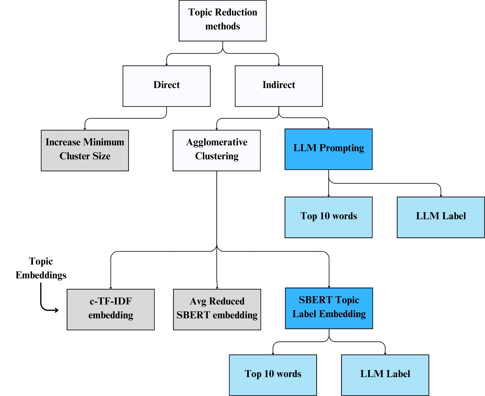

# A Comparative Analysis of Topic Reduction Techniques for BERTopic

This repository contains the data and a Python notebook to reproduce the results and techniques presented in our paper:  
**_“A Comparative Analysis of Topic Reduction Techniques for BERTopic”_**

## Abstract
*BERTopic is a state-of-the-art topic modeling framework that generates topics by clustering contextualized document embeddings. However, its default clustering algorithm, HDBSCAN, often generates an excessive number of topics, which hinders meaningful comparisons or applications in downstream tasks. While different topic reduction methods exist, literature lacks a comparison of these methods and their impact on the quality of the reduced topics. This study offers an in-depth exploration of (1) topic reduction methods for BERTopic, including existing approaches for direct or indirect reduction, and (2) novel techniques that leverage large language models (LLMs), either by using the LLM-generated topic labels to create topic embeddings or by directly prompting the model for identifying overlapping topics. A comparative study of these topic reduction methods is performed, evaluating their performance in terms of coherence and diversity across multiple social media and web datasets. Our findings indicate that indirect topic reduction (e.g., agglomerative clustering) yields more diverse topics, though sometimes at the cost of coherence, compared to direct topic reduction (increasing the minimum cluster size). LLM prompting outperforms agglomerative clustering in both coherence and diversity, though at a higher computational cost. Therefore, we recommend selecting a reduction method based on dataset characteristics, computational resources, and the desired balance between diversity and coherence.*  

## Overview of Topic Reduction Techniques

We evaluate a range of topic reduction strategies applicable to BERTopic, focusing on their effects on coherence, diversity, and downstream usability. The methods compared in this study are given in the following figure:

This study provides guidance on selecting appropriate reduction methods based on dataset characteristics, performance priorities (e.g., coherence or diversity), and computational constraints.

## Repository Structure

- `BERTopic_reduction.ipynb` – Main notebook containing the code and analysis.
- `data/` – Folder containing input data used in the experiments.
- `topic_reduction_techniques.png` – Visual overview of topic reduction methods.
